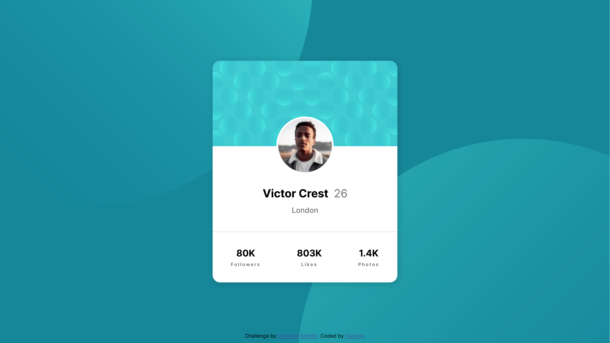

# Frontend Mentor - Profile card component solution

This is a solution to the [Profile card component challenge on Frontend Mentor](https://www.frontendmentor.io/challenges/profile-card-component-cfArpWshJ). Frontend Mentor challenges help you improve your coding skills by building realistic projects. 


## Table of contents

- [Overview](#overview)
  - [The challenge](#the-challenge)
  - [Screenshot](#screenshot)
- [My process](#my-process)
  - [Built with](#built-with)
  - [What I learned](#what-i-learned)
  - [Continued development](#continued-development)
- [Author](#author)


## Overview
### The challenge

- Build out the project to the designs provided

### Screenshot



## My process
### Built with

- Semantic HTML5 markup
- CSS custom properties
- Flexbox
- Grid
- Position & z-index
- Media queries


### What I learned

- Grid: 
  For the card, I started by creating a 3-column grid layout, naming the grid items '.one,' '.two,' and '.three' from top to bottom.

  ```css
  .card{
    display: grid;
    grid-template-rows: 2fr 2fr 1.2fr;
  }
  ```

- Flexbox: 
  Flexbox was applied in two areas: within grid item '.three' to arrange its contents horizontally with space around each item, and in the background container to center the card both horizontally and vertically on the screen using justify-content: center and align-items: center respectively.

  ```css
  .three{
    display: flex;
    justify-content: space-around;
  }

  .bg-container{
    display: flex;
    justify-content: center;
    align-items: center;
  }
  ```

- Position & z-index:
  Position and z-index were used to overlap and stack elements.

  The background container has position: relative, ensuring it stays in its normal position. Within this container, the .bg-pattern elements are positioned using position: absolute. This allows them to be precisely placed, with parts of their full circular shapes overflowing and being hidden at the corners of the container.

  To control the stacking order, I've used z-index. The .bg-pattern elements have a z-index of 0, while the .card element has a z-index of 1. This correctly positions the .card element on top and in the middle of the background patterns.

  To place the profile image halfway on top of the div named '.one', I created another div element inside div .two. Both divs, one and two, maintained their relative position, staying in their normal position. A negative top position on '.two div' to achieve the profile image desired overlap.

   ```css
    .one{
      position: relative;
    }
    
    .two{
      position: relative;
    }
    
    .two div{
      position: absolute;
      top: -64px;
    }
    ```

- Media Query:
  I adopted a mobile-first workflow, initially designing for a 375px mobile browser window. The layout was then adjusted for an 800px breakpoint, ensuring a smooth, subtle transition to the desktop view.

  ```css
   @media (max-width: 800px) {
    .bg-pattern-top{
      top: -400px; 
      left: -240px; 
      height: 100%;
    }
    
    .bg-pattern-bottom{
      top: 400px; 
      right:-250px; 
      height: 100%;
    }
  }
  ```

### Continued development

Maintain a focus on mastering Flexbox, as well as working with overlapping elements through relative and absolute positioning, and the z-index. This continued practice will solidify my understanding and proficiency in techniques that are essential for creating and designing future projects.


## Author

- LinkedIn - (https://www.linkedin.com/in/hannah589/)
- Frontend Mentor - [@hannah589](https://www.frontendmentor.io/profile/hannah589)


